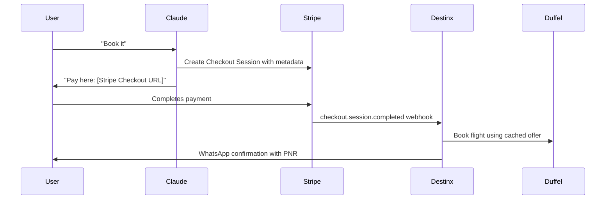
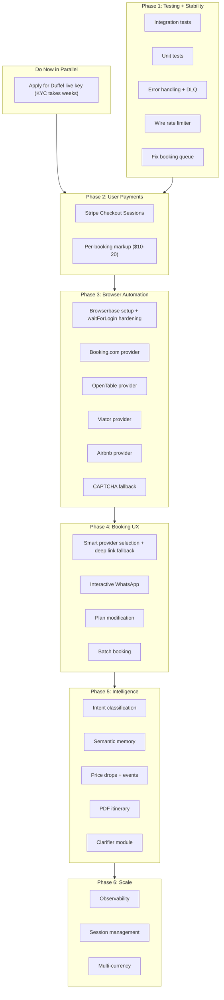

# Destinx: Production Roadmap

## Current State

**Working**: Flight search/booking (Duffel), hotel/restaurant/experience/transport search (Google Places), trip planning, memory/preferences, WhatsApp conversation loop, Redis search cache, conversation history with tool persistence.

**Stubbed/broken**: Browser automation booking queue (never enqueued from tool path), non-Marriott browser providers, PDF export, events search, price drop monitoring, WhatsApp media, payment infrastructure. Rate limiter exists but is never called. `recallRelevantMemories` and `researchDestination` are implemented but never wired into the main flow.

**Tests**: Only 3 files (`trip-schema.test.ts`, `deep-links.test.ts`, `state-machine.test.ts`).

**Hottest files** (most changes across all phases): `tool-executor.ts`, `orchestrator.ts`, `flights.ts`, `engine.ts`, `system.ts`.

---

## Phase 1: Testing + Stability (Week 1-2)

*Ship first. Can't build on a shaky foundation.*

### 1.1 Integration Test Harness

- Create `src/__tests__/integration/conversation-flow.test.ts` — mock Anthropic, Twilio, Duffel, Google Places. Send a simulated message through the full pipeline (handler -> queue -> engine -> Claude -> tools -> WhatsApp)
- Create `src/__tests__/integration/flight-booking.test.ts` — mock Duffel. Test cache hit path, cache miss fallback, and `isTestMode`
- Create `src/__tests__/helpers/mocks.ts` — centralized mocks. Add `ioredis-mock` as devDependency
- Build a `/dev/test-scenario` endpoint that runs predefined conversation scripts and asserts results
- Add smoke test that runs on every deploy (health + basic search)

### 1.2 Unit Tests for Critical Code

- `tool-executor.test.ts` — each tool handler in isolation
- `search-cache.test.ts` — Redis store/retrieve with TTL
- `memory-store.test.ts` — preference upsert, confidence decay
- `formatter.test.ts` — WhatsApp message formatting, character limits

### 1.3 Error Handling + Resilience

- Add DLQ + retry (3 attempts, exponential backoff) to BullMQ workers in [src/jobs/queue.ts](src/jobs/queue.ts)
- Wrap `processMessage` top-level in try/catch — if `recallUserProfile` or `getConversationHistory` throws, return a graceful fallback message
- **Wire the rate limiter** ([src/services/rate-limiter.ts](src/services/rate-limiter.ts) exists but is never called) into `engine.ts` before Claude calls and into `startBookingSession`
- Enforce Twilio signature validation in production (currently skipped when `APP_URL` unset)
- Add structured error codes (not just log strings) so errors are categorizable

### 1.4 UX Fixes

- `sendTypingIndicator` sends real text that counts against Twilio message limits — replace with contextual holding message only (or use Twilio's native typing indicator API)
- Allow a second holding message after 20s for multi-tool chains (flight search + booking can take 30s+)
- Wire `ensureTemplates()` into startup
- Fix booking queue wiring: `initiate_booking` in [src/services/conversation/tool-executor.ts](src/services/conversation/tool-executor.ts) calls `startBookingSession()` directly but never enqueues `executeBookingSession` on the `bookingQueue`. Wire it so browser booking runs asynchronously with WhatsApp callback on completion
- **WhatsApp compliance**: Add opt-out handler (user sends "STOP" -> mark user inactive, stop all outbound). Add opt-in acknowledgement on first message. Track template approval status. Required by Meta's 2026 WhatsApp Business policy — a few lines in [src/services/whatsapp/handler.ts](src/services/whatsapp/handler.ts) for STOP, an `active` flag on the `users` table, and a check before sending.

---

## Phase 2: User Payments (Week 2-3)

*Ship second. Every flight booked today drains your Duffel balance. This is existential.*

### 2.1 Stripe Checkout Sessions for Flights

Use **Stripe Checkout Sessions** (not Payment Links). Checkout Sessions are more flexible: they support metadata for booking correlation, webhook events with full context, custom success/cancel URLs, and programmatic control over the post-payment trigger. Payment Links are simpler for one-off sends but Checkout Sessions integrate better when you need to trigger a Duffel booking on completion.

- Add `stripe` dependency
- Create `src/services/payments/stripe.ts` — `createCheckoutSession(amount, currency, bookingMetadata)` using `stripe.checkout.sessions.create()` with metadata containing `flightNumber`, `offerId`, `passengerHash`, `conversationId`
- Create `src/services/payments/webhook.ts` — on `checkout.session.completed`, extract metadata, trigger the actual Duffel booking, send confirmation to user via WhatsApp
- Create `src/routes/payments.ts` — `POST /webhook/stripe`
- Change `book_flight` handler: instead of booking immediately, create Checkout Session -> store pending booking -> return Checkout URL to Claude -> Claude sends it to user
- Add `stripeSessionId`, `paymentStatus` columns to `bookings` table
- **Revenue model**: Add a per-booking markup ($10-20 service fee per flight) baked into the Stripe charge amount. No subscription complexity yet. This is the simplest path to revenue.

**Flow**:

### 2.2 Browser Booking Payments

For hotels/restaurants/experiences via browser automation, the user pays directly on the provider's website (Booking.com, OpenTable, etc.). Destinx never handles the money. Just needs clear UX guidance in the system prompt — tell the user they'll complete payment in the live browser session.

### 2.3 Duffel Payment Migration

**Decision (confirmed)**: Start with **your own Stripe** — charge user first (flight cost + service fee), then book with Duffel balance. This is simpler and the balance flow already works. Duffel Pay (where Duffel gives you a Stripe-compatible `client_secret` and the user pays Duffel directly) is a later optimization when volume justifies the tighter integration.

Switch `type: 'balance'` (line 160 in [src/services/search/flights.ts](src/services/search/flights.ts)) — keep using balance, but only trigger the Duffel booking AFTER Stripe payment is confirmed. The Duffel balance effectively becomes your float.

### 2.4 Duffel Live API Key

**Apply for Duffel production API access now.** KYC takes days to weeks. You can keep testing with the `duffel_test_` key in parallel — the code already detects test mode via `isTestMode` and handles it gracefully. Once the live key arrives, swap it in the env var and real airline bookings work immediately with no code changes.

---

## Phase 3: Browser Automation (Week 3-5)

*Ship third. The Marriott provider proves the pattern works. Each new provider is incremental.*

### 3.1 Browserbase Setup

Prerequisites: Sign up at browserbase.com, get API key and project ID, replace `bb_REPLACE_ME` and `proj_REPLACE_ME` in env vars. The Marriott provider ([src/services/booking/providers/marriott.ts](src/services/booking/providers/marriott.ts)) is already implemented. Test it end-to-end.

- **Harden `waitForLogin`**: Replace naive `observe()` poll with a multi-signal approach — check for user account name, session cookies, URL change away from login page. Add configurable `pollInterval` and `timeout` per provider. Add CAPTCHA detection mid-login via `handleCaptcha()` in the base provider.

### 3.2 Booking.com Hotel Provider

Highest impact — widest inventory, no loyalty login needed.

- Implement [src/services/booking/providers/booking-com.ts](src/services/booking/providers/booking-com.ts) following the Marriott pattern
- Navigate -> search -> select room -> pause for user payment -> extract confirmation
- Add to `executeProviderFlow` switch in [src/services/booking/orchestrator.ts](src/services/booking/orchestrator.ts)

### 3.3 OpenTable Restaurant Provider

- Implement [src/services/booking/providers/opentable.ts](src/services/booking/providers/opentable.ts)
- Search -> select time slot -> pause for user login/details -> confirm

### 3.4 Viator Experience Provider

- Implement [src/services/booking/providers/viator.ts](src/services/booking/providers/viator.ts)
- Search -> select date/participants -> pause for payment -> confirm

### 3.5 Provider Resilience

- Screenshot on every step transition (audit trail), upload to Cloudflare R2
- Implement `uploadMediaForSharing` in [src/services/whatsapp/media.ts](src/services/whatsapp/media.ts) using R2 (env vars already in `env.ts`)
- Use `automation_scripts` table to track per-provider step success rates
- Wire failure screenshot upload in [src/services/booking/orchestrator.ts](src/services/booking/orchestrator.ts) (~line 140) — currently captures buffer but returns `null`
- **CAPTCHA fallback**: Browserbase handles most CAPTCHAs natively. For failures, notify user to solve via Live View (already in `BaseBookingProvider.handleCaptcha()`). Add optional 2Captcha API integration as a fallback for headless scenarios. Add `TWO_CAPTCHA_API_KEY` to [src/config/env.ts](src/config/env.ts) as optional.

### 3.6 Airbnb Provider

- Implement [src/services/booking/providers/airbnb.ts](src/services/booking/providers/airbnb.ts) following the Marriott/Booking.com pattern
- Navigate -> search -> select listing -> pause for user login -> pause for payment -> extract confirmation
- Lower priority than Booking.com (Airbnb has stricter anti-bot measures), but included for inventory coverage
- Add to `executeProviderFlow` switch in [src/services/booking/orchestrator.ts](src/services/booking/orchestrator.ts)

---

## Phase 4: Booking UX Polish (Week 5-7)

### 4.1 Smart Provider Selection

Create `src/services/booking/provider-selector.ts` — deterministic logic:

- Hotel matches known chain + user has loyalty -> use chain site (Marriott.com)
- Otherwise -> Booking.com
- Restaurants -> OpenTable
- Experiences -> Viator
- **Deep link fallback**: When browser automation fails or a provider is not yet implemented, fall back to pre-filled deep links from [src/utils/deeplink.ts](src/utils/deeplink.ts) (already built). The selector should return `{ method: 'browser' | 'deeplink', provider, url }` so the orchestrator can route accordingly.

### 4.2 Interactive WhatsApp Messages

- Implement `sendInteractiveButtons` and `sendListMessage` using Twilio Content API (templates already defined in [src/services/whatsapp/templates.ts](src/services/whatsapp/templates.ts))
- Plan delivery: use Previous/Next/Overview navigation buttons
- Handle `buttonPayload` and `listSelection` in [src/services/whatsapp/handler.ts](src/services/whatsapp/handler.ts) — route `prev_day`, `next_day`, `approve_booking`, `cancel_booking`

### 4.3 Plan Modification

- Create `src/services/planning/modifier.ts` — accepts current itinerary + modification request, uses Claude to produce a delta, applies it, re-delivers changed days only
- Add `modify_trip_plan` tool to [src/ai/tools.ts](src/ai/tools.ts)

### 4.4 Batch Booking from Itinerary

- Create `src/services/booking/batch.ts` — when user says "LOVE IT", extract all bookable items from the plan
- Priority order: flights -> hotels -> experiences -> restaurants
- Queue sequentially on `bookingQueue`
- Send checklist to user with progress updates

---

## Phase 5: Intelligence (Week 7-9)

### 5.1 Upgrade Intent Classification

Replace keyword regex in [src/services/conversation/intent.ts](src/services/conversation/intent.ts) with a Haiku call + few-shot examples. Cache results in Redis. Keep regex as fast path for trivial intents (`hi`, `yes`, `no`).

### 5.2 Activate Semantic Memory

`recallRelevantMemories` is implemented in [src/services/memory/recall.ts](src/services/memory/recall.ts) but never called in the main flow. Wire it into `recallUserProfile` with the current message as the query vector. Attach results to `profile.semanticMemories`.

### 5.3 Wire Research into Planning

`researchDestination` is implemented in [src/services/planning/research.ts](src/services/planning/research.ts) but never called. Wire it into the planning prompt so trip plans include real destination data (costs, events, advisories, practical info).

### 5.4 Proactive Trip Intelligence

- Implement [src/services/tools/events.ts](src/services/tools/events.ts) — Ticketmaster/PredictHQ for festivals during travel dates
- Implement `checkPriceDrop` in [src/services/planning/pricing.ts](src/services/planning/pricing.ts) — compare live vs original prices, notify user on >10% drops
- Fix price-check scheduler — `startScheduler` adds `'check-all-prices'` with empty `{}`, but `processPriceCheck` expects `bookingId`, `originalPrice`, etc.

### 5.5 PDF Itinerary

Implement [src/services/planning/pdf.ts](src/services/planning/pdf.ts) using `pdfkit` — day-by-day schedule, booking references, QR codes for Google Maps links. Upload to R2, send via WhatsApp media.

### 5.6 Post-Trip Feedback Loop

Fix [src/jobs/scheduler.ts](src/jobs/scheduler.ts) — join with `users` table to get phone numbers, queue actual feedback jobs. Weight post-trip feedback at higher confidence in the memory extractor.

### 5.7 Clarifier Module

- Create [src/services/conversation/clarifier.ts](src/services/conversation/clarifier.ts) — given current trip context, identify missing required fields (dates, budget, travelers) before calling `create_trip_plan`. Return a structured list of questions for Claude to ask.
- Wire into the `create_trip_plan` tool handler in [src/services/conversation/tool-executor.ts](src/services/conversation/tool-executor.ts) so incomplete plans get clarifying questions instead of hallucinated defaults.

---

## Phase 6: Scale + Ops (Ongoing)

### 6.1 Observability

- Correlation IDs on every log line (webhook -> queue -> engine -> tool -> response)
- Prometheus metrics at `/metrics` (tool latency, booking success rates, queue depth, Claude token usage)
- Sentry for error tracking
- Dashboard for key metrics: messages/day, bookings/day, error rates

### 6.2 Session Management

- Archive conversations older than 7 days
- Summarize old history with Claude if token budget exceeded (prevents context window overflow for power users)

### 6.3 Multi-Currency

- `convertCurrency()` using exchangerate.host API, cached in Redis
- User's preferred currency from profile preferences

### 6.4 Cost Controls

- Token usage tracking per user per month
- Enforce rate limiter per user
- Claude model selection: use Haiku for intent classification and preference extraction, keep Sonnet for main conversation

### 6.5 Security

- PII redaction in logs (phone numbers, emails, passport details)
- Encrypt sensitive user data at rest
- Audit log for all bookings
- GDPR compliance: data export and deletion endpoints

---

## Execution Priority

**Biggest bang-for-buck**: Phase 2.1 (Stripe Checkout Sessions) — one afternoon of work removes the entire financial risk of the business.

---

## Decisions Made

- **Duffel payment**: Own Stripe first (charge user, book with Duffel balance). Duffel Pay is a later optimization when volume justifies it.
- **Revenue model**: Per-booking markup ($10-20 service fee per flight, baked into Stripe charge). No subscription complexity yet.
- **Duffel live key**: Apply NOW. KYC takes days/weeks. Keep testing with test key in parallel. No code changes needed when live key arrives.

## Decisions Still Needed

- **Browserbase plan**: Which tier? Free tier has limited sessions. Production booking automation needs a paid plan.
- **Service fee amount**: $10 flat? $15? Percentage-based (3-5%)? Start with flat fee, optimize later with data.
